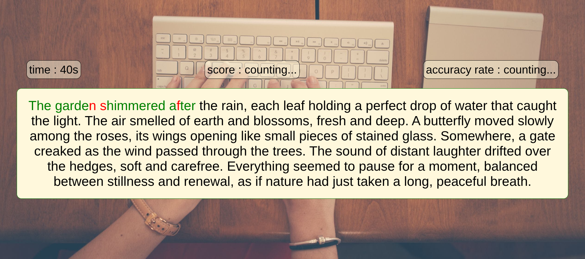
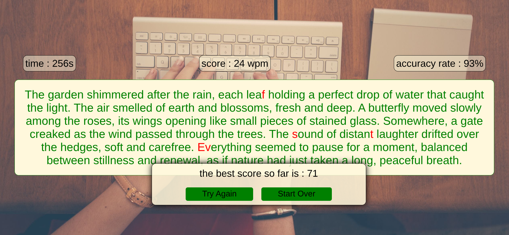

---

## Typing Speed Game**

```markdown
# Typing Speed Game – Play the DOM!

## Description
Typing Speed Game is an interactive web mini-game to improve typing speed and accuracy while practicing DOM manipulation. Users must type the displayed text as quickly and correctly as possible.

This project was part of the **DOM Gamification: Play the DOM!** assignment for the YouCode platform.

**Technologies used:** HTML5, CSS3, JavaScript, Flexbox, Responsive Design, JSON.

---

## Features

- Display of text or phrases for the user to type.
- Real-time highlighting of correct and incorrect letters.
- Countdown timer (e.g., 60 seconds) for each game session.
- Automatic calculation of words per minute (WPM) and accuracy rate.
- Display of final score and performance message.
- Option to replay and improve scores.

### Bonus Features
- Multiple difficulty levels: simple vs. complex sentences.
- Random phrase.
- Leaderboard for best local scores.

---

## Installation

1. Clone the repository:
   ```bash
   git clone https://github.com/elgmouriabderrahim/brief4-Typing-Speed-Game.git


## Screenshots




